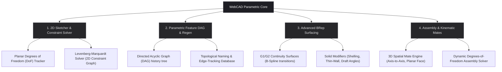

# Road to CATIA & Autodesk Inventor: Advanced Parametric Architecture

This document establishes the strategic engineering and mathematical roadmap for transitioning WebCAD from a direct-mode CSG modeler into a professional, history-based, parametric CAD platform matching industry standards set by **Autodesk Inventor** and **Dassault Systèmes CATIA**.

---

## 🏛️ Architectural Overview

Professional mechanical CAD engines are built on four distinct pillars that manage geometric creation, relational constraint satisfaction, and history propagation.



---

## 1. 2D Sketcher & Geometric Constraint Solver (GCS)

In CATIA and Inventor, all 3D solid features originate from fully-constrained 2D Sketches. We must move beyond simple coordinates to a constraint-based sketching system.

### 📐 The Constraint Schema
To support professional drafting, the sketcher maps mathematical relations between points, lines, circles, and arcs:

| Constraint Type | Mathematical Relation / Equation | Objective Function Value |
| :--- | :--- | :--- |
| **Coincident** | $P_1(x_1, y_1) - P_2(x_2, y_2) = 0$ | Distance squared between points $\rightarrow 0$ |
| **Horizontal** | $P_1(y_1) - P_2(y_2) = 0$ | Delta $Y \rightarrow 0$ |
| **Vertical** | $P_1(x_1) - P_2(x_2) = 0$ | Delta $X \rightarrow 0$ |
| **Parallel** | $(P_2 - P_1) \times (P_4 - P_3) = 0$ | Determinant of line direction vectors $\rightarrow 0$ |
| **Perpendicular** | $(P_2 - P_1) \cdot (P_4 - P_3) = 0$ | Dot product of line direction vectors $\rightarrow 0$ |
| **Tangent** | Distance from circle center $C$ to line $L = R$ | Distance equation minus Radius $\rightarrow 0$ |
| **Concentric** | $C_1(x_1, y_1) - C_2(x_2, y_2) = 0$ | Distance squared between circle centers $\rightarrow 0$ |
| **Dimensional** | $\| P_2 - P_1 \| - D_{\text{target}} = 0$ | Euclidean distance minus dimension value $\rightarrow 0$ |

### 🧠 Solver Implementation Strategy
To solve these equations in real-time, we must integrate a Planar Geometric Constraint Solver (GCS):
1. **Degrees of Freedom (DoF) Calculation:** Track under-constrained, fully-constrained, and over-defined entities dynamically. Highlight under-constrained entities in **Blue**, fully-constrained in **Green**, and conflicts in **Red**.
2. **Graph-Based Decomposition:** Decompose the constraints into a bipartite graph of variables (coordinates) and equations (constraints). Identify independent closed sub-graphs to solve smaller systems sequentially rather than one massive system.
3. **Non-Linear Least Squares Solver:** Solve the equations using an iterative numerical solver (such as the **Levenberg-Marquardt** or **Powell's Dog-Leg** algorithm):
   $$\mathbf{J}^T \mathbf{J} \Delta \mathbf{x} = -\mathbf{J}^T \mathbf{F}(\mathbf{x})$$
   Where $\mathbf{J}$ is the Jacobian matrix of constraint derivatives, and $\mathbf{F}(\mathbf{x})$ is the vector of constraint errors.

> [!TIP]
> Exposing OpenCascade's `gp_Elips` and `Geom2d_BSplineCurve` will allow sketchers to handle advanced ellipses and splines, which is essential for high-fidelity mechanical design profiles.

---

## 2. Parametric Feature DAG & Topological Naming (Regen)

A professional CAD model is not static; it is a compiled recipe. Modifying `Sketch1` must automatically propagate, recalculating `Extrude1` and re-applying `Fillet1` flawlessly.

```
       [Sketch 1]
           │
       [Extrude 1]
       /        \
   [Fillet 1]  [Hole 1]
       \        /
       [Union 1] (Final Model)
```

### 🌲 Directed Acyclic Graph (DAG) Structure
Every feature (Sketch, Extrude, Chamfer, Thread, Cut) is registered as a node in a DAG:
* **Feature Execution:** Running a `REGEN` command walks the DAG topologically, executing each node's `execute()` sequence.
* **Rollback Pointer:** Allows the user to drag a history bar to any historical node, freezing downstream features and letting them edit sketches in-context.

### 🏷️ Topological Naming Problem (TNS)
The biggest challenge in parametric history modification is **The Topological Naming Problem**. 

> [!WARNING]
> If a user modifies `Sketch1` such that the number of extruded faces changes from 4 to 6, a downstream `Fillet1` bound to "Edge ID 3" will either apply to the wrong edge or fail completely.

To resolve this, we must build a Topological Naming System:
1. **Tracking Database:** Do not reference edges by index. Instead, name them based on their historical parents:
   $$\text{Edge ID} = \text{Face}_{\text{Left}} \cap \text{Face}_{\text{Right}}$$
2. **Generation Tracking:** An edge produced by an extrude is tagged as `Extrude_1_Face_3_Lateral_Edge_2`.
3. **OpenCascade Selection Tracking:** Utilize OpenCascade's `BRepTools_Reactions` or `TNaming_NamedShape` to track which faces/edges were generated, modified, or deleted by each operation, ensuring downstream feature bindings survive complex sketch updates.

---

## 3. Advanced Surface Modeling (G1/G2 Continuity)

Automotive design, aerospace, and high-end consumer products (such as CATIA's core domains) require advanced surface creation rather than simple prismatic blocks.

```
  G0 (Positional)      G1 (Tangency)      G2 (Curvature Continuous)
     Sharp Edge         Smooth Join            Perfect Blend
       ┌───┐               ┌───┐                  ╭───╮
       │   │              (     )                (     )
```

### 🏁 Surface Continuity Levels
We must expose surface continuity options in sweeps and lofts:

1. **G0 (Positional):** Surfaces touch, but there is a sharp angle at the boundary (e.g. sharp chamfer join).
2. **G1 (Tangential):** Surfaces join smoothly, sharing tangent vectors along the shared edge (e.g., standard round fillet). Light reflections break abruptly.
3. **G2 (Curvature Continuous):** Surfaces share the same rate of curvature change at the boundary. Reflective zebra stripes flow perfectly across G2 joints without breaks.

### 📐 OpenCascade Surfacing Pipelines
To support G2 surfacing, we will implement these advanced OpenCascade interfaces:

*   **GeomFill_Sweep:** Sweeps a 2D profile along a primary guide curve (spine) while maintaining orientation relative to auxiliary **guide curves** to shape complex organic geometries.
*   **Geom_BSplineSurface:** Generates customizable NURBS surfaces defined by arrays of control points, weights, knots, and multiplicities.
*   **BRepOffsetAPI_MakeThruSections:** Creates smooth lofts across multiple open or closed profiles, utilizing tangent constraints (`SetSmoothing`) to enforce G1 or G2 continuity at the end profiles.

### 🍉 Solid Thickness & Shelling
*   **BRepOffsetAPI_MakeOffsetShape:** Provides true solid hollowing (**Shelling**), allowing the user to select specific faces to remove, creating thin-walled enclosures with highly precise internal offsets.
*   **Draft Angles (`BRepOffsetAPI_DraftAngle`):** Taper vertical faces relative to a pull direction, which is essential for injection-molded plastic parts to slip cleanly out of physical tooling.

---

## 4. Assemblies & Kinematic Constraints

Inventor and CATIA coordinate assemblies of multiple separate components using mating relations.

### 🧩 Assembly Structure
Components are stored as independent solid entities and mapped to the scene graph using affine transformation matrices ($[R \mid T]$).

```typescript
interface ComponentInstance {
  id: string;
  sourceFile: string; // References nested STEP file block
  transform: number[]; // 4x4 coordinate transform matrix relative to assembly root
  constraints: AssemblyConstraint[];
}
```

### 🤝 Mating Constraint Engine
Assemblies are constructed using kinematic mating conditions:

*   **Mate / Flush:** Restricts positional displacement by aligning the planar normals of two solid faces ($\mathbf{n}_1 \cdot \mathbf{n}_2 = \pm 1$).
*   **Insert / Axis-to-Axis:** Align concentric holes by locking two cylindrical axes in alignment, which is essential for fastening screws, bolts, and shafts.
*   **Degrees of Freedom (DoF) Dynamic Assembly Solver:** Employs a spatial numerical solver that adjusts the transform matrices ($[R \mid T]$) of each component instance to satisfy all active mate equations, blocking illegal transformations while allowing accurate kinematic movement previews.

---

## 📅 Phased Implementation Plan

To systematically build these features, we will divide the development into four distinct, logical milestones:

```
[ Milestone 1 ] ──► [ Milestone 2 ] ──► [ Milestone 3 ] ──► [ Milestone 4 ]
Surfacing & Shells    Parametric History     GCS Sketcher Solver   Assemblies & Mates
```

### Milestone 1: Advanced Solid & Surface Operations (Surfacing)
*   **Surfaces:** Implement custom NURBS surface construction via boundary curves and coordinate point arrays.
*   **Shelling & Drafts:** Wrap `BRepOffsetAPI_MakeOffsetShape` to enable solid hollowing, and `BRepOffsetAPI_DraftAngle` for mechanical taper features.
*   **Continuity:** Add G1/G2 smoothing toggle options to sweeps, lofts, and edge fillets.

### Milestone 2: Parametric DAG & Topological Naming (History)
*   **DAG Engine:** Implement a feature-based Directed Acyclic Graph tree in WebCAD.
*   **Tree UI:** Build an interactive History sidebar list with a drag-and-drop Rollback bar.
*   **Topological Tracking:** Expose OpenCascade's modified shape reactions to dynamically track and update downstream edge selections when upstream parameters change.

### Milestone 3: Planar Sketcher & Numerical Solver (GCS)
*   **Constraint Sketch Canvas:** Build a dedicated 2D Sketching sub-mode inside the viewport.
*   **Planar Solver:** Integrate a Levenberg-Marquardt numeric GCS for Horizontal, Tangent, Coincident, and Dimensional constraint solving.
*   **DoF UI:** Implement visual coloring indicating under-constrained and fully-constrained lines.

### Milestone 4: Assembly Component Modeler (Assemblies)
*   **Scene Graph:** Introduce multi-instance nested component referencing.
*   **Kinematic Engine:** Build planar mate and concentric insert axis assembly solvers.
*   **DOF Assembly Preview:** Enable dynamic kinematic movement testing in the viewport.
