# Road to CATIA & Autodesk Inventor: Advanced Parametric Architecture

This document establishes the strategic engineering and mathematical roadmap for transitioning WebCAD from a direct-mode CSG modeler into a professional, history-based, parametric CAD platform matching industry standards set by **Autodesk Inventor** and **Dassault Systèmes CATIA**.

---

## Architectural Overview

Professional mechanical CAD engines are built on four distinct pillars that manage geometric creation, relational constraint satisfaction, and history propagation.

```mermaid
graph TD
    classDef main fill:#1e1e24,stroke:#3f3f46,stroke-width:2px,color:#fafafa;
    classDef sub fill:#27272a,stroke:#52525b,stroke-width:1px,color:#e4e4e7;

    A[WebCAD Parametric Core]:::main --> B[1. Parametric Feature DAG & Regen]:::sub
    A --> C[2. 2D Sketcher & Constraint Solver]:::sub
    A --> D[3. Advanced BRep Surfacing]:::sub
    A --> E[4. Assembly & Kinematic Mates]:::sub

    B --> B1["Directed Acyclic Graph (DAG) history tree"]
    B --> B2["Topological Naming & Edge-Tracking Database"]
    B --> B3["Dirty-flag partial regen"]

    C --> C1["Planar Degrees of Freedom (DoF) Tracker"]
    C --> C2["Levenberg-Marquardt Solver (2D Constraint Graph)"]
    C --> C3["Rigid-body sub-graph decomposition"]

    D --> D1["G1/G2 Continuity Surfaces (B-Spline transitions)"]
    D --> D2["Solid Modifiers (Shelling, Thin-Wall, Draft Angles)"]
    D --> D3["Curvature comb & zebra stripe diagnostics"]

    E --> E1["3D Spatial Mate Engine (Axis-to-Axis, Planar Face)"]
    E --> E2["Dynamic Degrees-of-Freedom Assembly Solver"]
```



---

## Why this ordering matters

The milestones follow a strict dependency chain. The **Parametric Feature DAG is the foundation** — without it, surfaces and sketches are direct-mode geometry that must be torn out and rebuilt once history is introduced. The GCS Sketcher is the entry point for every feature, so the DAG must exist before sketcher output has anywhere meaningful to go. Advanced surfacing and assemblies sit naturally on top of the established infrastructure.

```
[ Milestone 1 ] ──► [ Milestone 2 ] ──► [ Milestone 3 ] ──► [ Milestone 4 ]
Parametric DAG       GCS Sketcher       Surfacing & Shells   Assemblies & Mates
& Topo Naming        & Solver           & STEP Import
```

---

## Milestone 1: Parametric Feature DAG & Topological Naming

A professional CAD model is not static; it is a compiled recipe. Modifying `Sketch1` must automatically propagate, recalculating `Extrude1` and re-applying `Fillet1` flawlessly. This infrastructure must exist before any other parametric feature is built.

```
       [Sketch 1]
           │
       [Extrude 1]
       /        \
   [Fillet 1]  [Hole 1]
       \        /
       [Union 1] (Final Model)
```

### Directed Acyclic Graph (DAG) structure

Every feature (Sketch, Extrude, Chamfer, Thread, Cut) is a node in a DAG:

- **Feature execution:** A `REGEN` command walks the DAG topologically, calling each node's `execute()` in order.
- **Rollback pointer:** Allows the user to drag a history bar to any historical node, freezing downstream features and letting them edit sketches in-context.
- **Partial regen (dirty-flag propagation):** Full DAG walks on every parameter change are too slow for complex models. Nodes carry a `dirty` flag; only nodes downstream of a changed node re-execute. This is essential for interactive performance and must be designed in from the start, not retrofitted.

```typescript
interface FeatureNode {
  id: string;
  type: 'sketch' | 'extrude' | 'fillet' | 'shell' | 'cut' | 'loft' | 'sweep';
  dirty: boolean;
  inputs: string[];   // upstream node IDs
  outputs: string[];  // downstream node IDs
  params: Record<string, unknown>;
  execute(context: RegenContext): Promise<void>;
  invalidate(): void; // marks self and all downstream nodes dirty
}
```

### Topological Naming Problem (TNS)

The hardest challenge in parametric history modification. If a user modifies `Sketch1` such that the number of extruded faces changes from 4 to 6, a downstream `Fillet1` bound to "Edge ID 3" will either apply to the wrong edge or fail completely.

> **Important:** TNS is the hardest unsolved problem in open-source parametric CAD. FreeCAD spent nearly a decade on it. OpenCascade's `TNaming` subsystem is powerful but requires threading naming through every single OCC operation from the ground up — it cannot be retrofitted after the fact. Budget significant time accordingly.

**Recommended two-phase approach:**

**Phase 1 — Semantic tagging (ship this first):**
Name edges and faces by their generation semantics rather than indices. Accept that rename failures will require manual reselection from the user; this is workable for a v1 parametric system.

$$\text{Edge ID} = \text{Face}_{\text{Left}} \cap \text{Face}_{\text{Right}}$$

An edge produced by an extrude is tagged `Extrude_1_Face_3_Lateral_Edge_2`. Downstream features bind to this string token. When a regen changes the face count, unresolved bindings surface as warnings rather than silent corruption.

**Phase 2 — OCC TNaming instrumentation:**
Add `TNaming_Builder` annotations to every OCC operation in `OCCWorker.ts`. This enables proper `TNaming_Selector` lookups so downstream feature bindings survive complex sketch updates automatically. This is a substantial instrumentation effort and belongs after Phase 1 is proven in production.

### Undo/redo model migration

The current `HistoryManager` is a flat stack of entity operations. In a DAG-based system, undo means "remove the last feature from the DAG and regen from the dirty point." This is a fundamentally different model and the transition requires its own design pass before Milestone 1 begins. Both systems cannot coexist without a clear migration boundary.

---

## Milestone 2: 2D Sketcher & Geometric Constraint Solver (GCS)

In CATIA and Inventor, all 3D solid features originate from fully-constrained 2D Sketches. We must move beyond simple coordinates to a constraint-based sketching system.

### The constraint schema

| Constraint Type | Mathematical Relation | Objective Function |
| :--- | :--- | :--- |
| **Coincident** | $P_1(x_1, y_1) - P_2(x_2, y_2) = 0$ | Distance² between points $\rightarrow 0$ |
| **Horizontal** | $P_1(y_1) - P_2(y_2) = 0$ | Delta $Y \rightarrow 0$ |
| **Vertical** | $P_1(x_1) - P_2(x_2) = 0$ | Delta $X \rightarrow 0$ |
| **Parallel** | $(P_2 - P_1) \times (P_4 - P_3) = 0$ | Determinant of direction vectors $\rightarrow 0$ |
| **Perpendicular** | $(P_2 - P_1) \cdot (P_4 - P_3) = 0$ | Dot product of direction vectors $\rightarrow 0$ |
| **Tangent (line–circle)** | $\text{dist}(C, L) - R = 0$ | Distance from center to line minus radius $\rightarrow 0$ |
| **Tangent (arc–arc)** | $\hat{t}_1(s) - \hat{t}_2(s) = 0$ | Matching tangent unit vectors at contact point $\rightarrow 0$ |
| **Concentric** | $C_1(x_1, y_1) - C_2(x_2, y_2) = 0$ | Distance² between circle centers $\rightarrow 0$ |
| **Dimensional** | $\|P_2 - P_1\| - D_{\text{target}} = 0$ | Euclidean distance minus dimension value $\rightarrow 0$ |
| **Equal length** | $\|P_2 - P_1\| - \|P_4 - P_3\| = 0$ | Difference of segment lengths $\rightarrow 0$ |
| **Symmetric** | $P_{\text{mid}} - \frac{P_1 + P_2}{2} = 0$ | Midpoint offset from axis of symmetry $\rightarrow 0$ |
| **Midpoint** | $P_m - \frac{P_{\text{start}} + P_{\text{end}}}{2} = 0$ | Point distance from segment midpoint $\rightarrow 0$ |

Note that the tangent constraint has two distinct formulations. The line–circle form is the distance equation. Arc–arc and spline tangency require matching the tangent *vector* at the contact point, which is a different equation family and must be implemented separately.

### Solver implementation strategy

**Step 1 — Fixed and reference geometry.**
Before solving, establish anchored reference geometry (construction lines, ground-fixed points). Without at least one fixed anchor, a fully-constrained sketch still floats freely in the plane — the solver finds a valid solution but not necessarily where the user intended.

**Step 2 — Rigid-body sub-graph decomposition.**
Decompose the constraint graph into a bipartite graph of variables (point coordinates) and equations (constraints). Identify independent closed sub-graphs and solve each as a smaller system sequentially. Without this, a 50-entity sketch presents a 100-variable system to the solver when it could be 10 independent 8-variable sub-systems, each converging in milliseconds. FreeCAD's open-source `planegcs` library is a directly applicable reference implementation.

**Step 3 — Non-Linear Least Squares Solver.**

$$\mathbf{J}^T \mathbf{J} \, \Delta \mathbf{x} = -\mathbf{J}^T \mathbf{F}(\mathbf{x})$$

Where $\mathbf{J}$ is the Jacobian matrix of constraint derivatives and $\mathbf{F}(\mathbf{x})$ is the vector of constraint errors. Use **Levenberg-Marquardt** or **Powell's Dog-Leg** as the iterative solver.

### DoF visualization

Track and display constraint status dynamically:

| State | Color | Meaning |
| :--- | :--- | :--- |
| Under-constrained | Blue | Entity still has free degrees of freedom |
| Fully constrained | Green | Entity is completely determined |
| Over-defined / conflict | Red | Contradictory constraints applied |

> **Tip:** Exposing OpenCascade's `gp_Elips` and `Geom2d_BSplineCurve` will allow the sketcher to handle advanced ellipses and splines, which is essential for high-fidelity mechanical design profiles.

---

## Milestone 3: Advanced Surface Modeling & STEP Import

### Surface continuity levels

```
  G0 (Positional)      G1 (Tangency)      G2 (Curvature Continuous)
     Sharp Edge         Smooth Join            Perfect Blend
       ┌───┐               ┌───┐                  ╭───╮
       │   │              (     )                (     )
```

| Level | Definition | Visual result |
| :--- | :--- | :--- |
| **G0** | Surfaces touch; no angle constraint | Sharp edge at boundary |
| **G1** | Surfaces share tangent vectors along the boundary | Smooth join; light reflections break abruptly |
| **G2** | Surfaces share curvature (matching second derivatives) | Reflective zebra stripes flow unbroken across the joint |

### Enforcing G2 — what it actually requires

Matching tangent vectors is G1. G2 requires matching the *rate of change of curvature* — the second derivative of the surface — along the shared boundary. In practice this means:

- The surface must have polynomial degree ≥ 3 in both parametric directions.
- When calling `BRepOffsetAPI_MakeThruSections`, `SetSmoothing(true)` yields G1 by default. Achieving true G2 requires building explicit compatible boundary conditions using `GeomFill_BoundWithSurf` (or equivalent), specifying curvature-matching tangent frames at each profile.

This is a non-trivial OCC workflow. Do not conflate "smooth loft" with "G2 loft" in the UI or documentation.

### OpenCascade surfacing pipelines

- **`GeomFill_Sweep`:** Sweeps a 2D profile along a spine curve while maintaining orientation relative to auxiliary guide curves, enabling complex organic geometries.
- **`Geom_BSplineSurface`:** Generates NURBS surfaces defined by arrays of control points, weights, knots, and multiplicities.
- **`BRepOffsetAPI_MakeThruSections`:** Smooth lofts across multiple profiles with tangent constraints (`SetSmoothing`) for G1/G2 end continuity.

### Solid modifiers

- **`BRepOffsetAPI_MakeOffsetShape` (Shelling):** True solid hollowing — select faces to remove, creating thin-walled enclosures with precise internal offsets.
- **`BRepOffsetAPI_DraftAngle` (Draft angles):** Taper vertical faces relative to a pull direction; required for injection-molded plastic parts.

### Diagnostic surface quality tools

G2 surfacing without visualization tools is nearly unusable in practice. These diagnostics are as important as the surfacing operations themselves:

- **Curvature comb:** A rendered comb of normals along a curve or surface edge, scaled by local curvature. Discontinuities in comb length indicate G1 failures; discontinuities in comb direction indicate G0 failures.
- **Zebra stripe shader:** A fragment shader that renders alternating light/dark bands on the model surface. G0 joints show broken stripes; G1 joints show angled breaks; G2 joints show continuous flowing stripes.

Both can be implemented as Three.js custom `ShaderMaterial` passes on the existing `Viewer` render pipeline.

### STEP import

The `ComponentInstance` interface (Milestone 4) implies STEP import as the feeder for external components. `STEPControl_Reader` is available in the existing OCC build and should be exposed in this milestone rather than deferred, so the surfacing and STEP pipelines share the same OCC integration work.

---

## Milestone 4: Assemblies & Kinematic Constraints

### Assembly structure

Components are independent solid entities positioned in the scene via affine transformation matrices. The `ComponentInstance` interface:

```typescript
interface ComponentInstance {
  id: string;
  componentId: string;         // references an entry in the component registry
  transform: THREE.Matrix4;    // 4×4 world-space transform relative to assembly root
  constraints: AssemblyConstraint[];
}

interface ComponentRegistry {
  components: Map<string, ComponentDefinition>;
}

interface ComponentDefinition {
  id: string;
  name: string;
  sourceFile?: string;         // optional path to STEP file for external components
  document?: Document;         // in-memory geometry for components defined within the session
}
```

Note: `transform` must be a typed `THREE.Matrix4` (or equivalent explicit 4×4 type), not a flat `number[]`. A flat 16-element array with no enforced layout is a bug source at every matrix multiply.

### Mating constraint engine

| Constraint | Mathematical condition | DoF removed |
| :--- | :--- | :--- |
| **Mate / Flush** | $\mathbf{n}_1 \cdot \mathbf{n}_2 = \pm 1$ and $d = 0$ | 3 (1 rotation + 2 translation) |
| **Insert / Axis-to-Axis** | Cylindrical axes aligned and concentric | 4 (2 rotation + 2 translation) |
| **Angle** | $\cos^{-1}(\mathbf{n}_1 \cdot \mathbf{n}_2) = \theta$ | 1 (rotation about shared normal) |
| **Distance** | $\|P_1 - P_2\| = d_{\text{target}}$ | 1 (translation along axis) |

The mate solver adjusts component `transform` matrices to satisfy all active constraint equations while leaving remaining DoF free for kinematic motion preview.

### Phased assembly delivery

A useful intermediate milestone: basic assembly without a mate solver. Let users place parts manually using transform gizmos with no constraint enforcement. This ships real value (multi-body scene composition, STEP import review) while the constraint solver is being built in parallel.

---

## Phased implementation plan

### Milestone 1 — Parametric Feature DAG

- Design and implement the DAG node graph with dirty-flag partial regen.
- Implement Phase 1 topological naming (semantic string tags on faces/edges).
- Migrate undo/redo from the flat `HistoryManager` to DAG-rollback model.
- Build the interactive History sidebar with rollback bar.

### Milestone 2 — GCS Sketcher

- Build the dedicated 2D sketching sub-mode in the viewport.
- Implement fixed/reference geometry anchoring.
- Integrate rigid-body sub-graph decomposition ahead of the solver.
- Integrate Levenberg-Marquardt GCS for Coincident, Horizontal, Vertical, Parallel, Perpendicular, Tangent, Concentric, Dimensional, Equal, Symmetric, and Midpoint constraints.
- Implement DoF visual coloring (blue / green / red).
- Expose `Geom2d_BSplineCurve` and `gp_Elips` for advanced sketch curves.

### Milestone 3 — Advanced Surfacing & STEP Import

- Expose `STEPControl_Reader` for STEP file import.
- Implement NURBS surface construction via `Geom_BSplineSurface`.
- Add G1 and true G2 loft/sweep continuity options with correct boundary conditions.
- Wrap `BRepOffsetAPI_MakeOffsetShape` for shelling.
- Wrap `BRepOffsetAPI_DraftAngle` for mechanical taper features.
- Implement curvature comb and zebra stripe diagnostic shaders.
- Begin Phase 2 TNaming instrumentation (`TNaming_Builder` on all OCC operations).

### Milestone 4 — Assembly Component Modeler

- Introduce multi-instance component registry with `THREE.Matrix4` transforms.
- Build manual placement mode with gizmo-based component positioning.
- Implement mate / flush and axis-to-axis kinematic constraint solver.
- Enable kinematic DoF motion preview in the viewport.
- Complete Phase 2 TNaming so downstream feature bindings survive assembly-level regen.