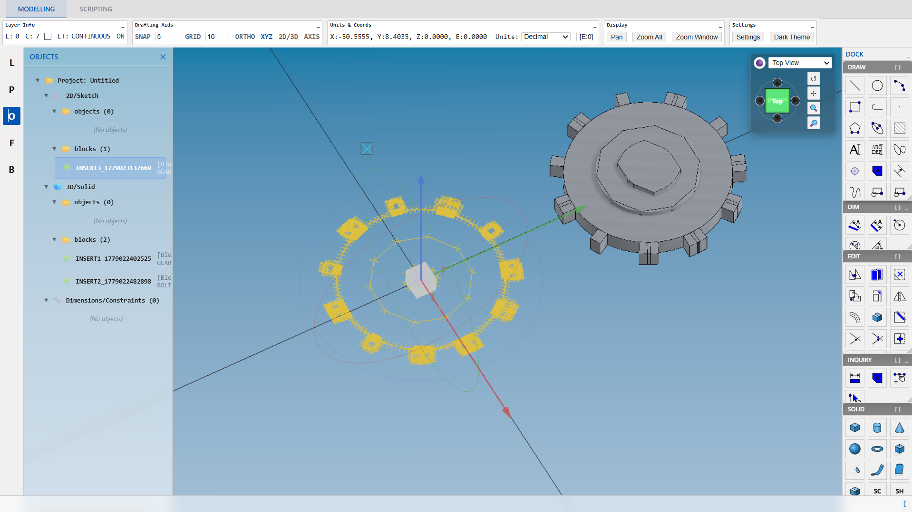
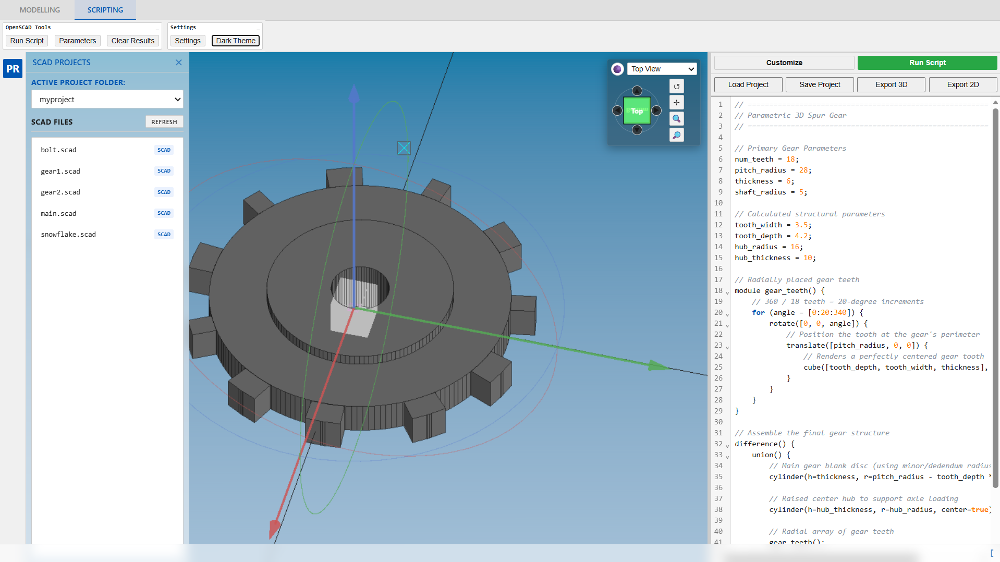

# WebCAD 

A faithful CAD drafting experience, reimagined for the modern web using **TypeScript**, **Three.js**, and **Vite**.






## 🚀 Features

### 🎯 Precision Drafting
- **Geometric Kernel:** Powered by **OpenCascade.js** (OCCT) and optimized for high-performance 2D drafting and 3D modeling operations.
- **Snap Engine:** Real-time, sub-pixel snapping modes (Endpoint, Midpoint, Center, Bulge Center) and adjustable **GRID Snap**.
- **Drafting Aids:**
  - **ORTHO:** Restricts vector paths strictly to horizontal/vertical axes.
  - **GRID:** Scalable visual reference dot grid that pans and updates fluidly with the viewport camera.
  - **SNAP:** Configurable discrete coordinate input spacing intervals.
  - **Coordinate Parser:** Fully supports absolute (`x,y`), relative Cartesian (`@dx,dy`), and relative Polar (`@dist<angle`) formatting.
- **Interactive Previews:** Asynchronous, state-machine based command loops rendering real-time rubber-banding lines, arcs, circles, and curves during editing.

### 💾 File I/O & Interoperability
- **Custom DXF Parser & Writer:** High-fidelity R12/R14 DXF engine for saving and loading complex CAD drawings with layers, hatches, and blocks.
- **Parametric Block Library:** A modular block registration system supporting 2D sketches and 3D solids.
  - **Dynamic Sidebar Folder Browsing:** Browses local block files (`blocks/2D` and `blocks/3D`) with immediate popup thumbnails showing interactive previews of solids and sketches.
  - **Robust File Import:** Imports `.step` files for 3D solids and `.dxf` drawings for 2D blocks seamlessly.
  - **Instant Origin Placement:** Features a dedicated "Place" button to automatically instantiate a block definition directly at origin coordinates `(0, 0, 0)`.
- **Database Persistence:** Secure background storage using IndexedDB with structural integrity checks to prevent data corruption.

### ⌨️ Classic Commands
- **Drafting Suite:** `LINE`, `PLINE` (Polyline with bulge arcs), `ARC` (3-Point), `CIRCLE` (Center/Radius, Center/Diameter), `POLYGON` (Inscribed/Circumscribed), `SPLINE` (Cubic B-Spline), `SOLID`, `TEXT`, `HATCH` (leak-proof Midpoint Clipping with `.pat` pattern support).
- **Modification Tools:** `TRIM`, `EXTEND`, `FILLET` (tangent arc blending), `OFFSET`, `ARRAY` (Rectangular/Polar), `ERASE`, `MOVE`, `COPY`, `ROTATE`, `SCALE`, `MIRROR`, and `STRETCH` (Crossing Window vertex shifting).
- **Workspace Utilities:** `REGEN` (forces full redraw), `UNITS` (Decimal, Architectural, Metric with selectable precision), `NEW` (resets document with confirmation).
- **Dimensioning & Plotting:**
  - `DIMLINEAR`, `DIMALIGNED`, `DIMRADIUS`, `DIMANGULAR` with crisp engineering annotations and text gaps.
  - `PLOT` with high-fidelity vector SVG and PDF exporting (utilizing path-outlining via `opentype.js`).

### 🎮 3D Interaction & Persistence
- **3D Solid Modeling:** Integrated command suite to create primitive solids: `BOX`, `CYLINDER`, `SPHERE`, `CONE`, and `TORUS`.
- **Boolean CSG Operations:** High-level 3D Boolean Union, Subtraction, and Intersection operations powered by OpenCascade.
- **Interactive 3D Gizmo:** High-fidelity widget for precise 3D object translations and rotations.
- **Proportional Scaling:** Gizmo handles dynamically scale based on selected entity bounding box sizes.
- **Physical Save/Load (STEP):** 3D boolean shapes are serialized directly to professional STEP format in the persistent drawing DB.

### 🖼️ Rendering
- **Renderer:** Three.js **r185**, drawing into a single `<canvas>` through one `THREE.OrthographicCamera`. The `PERSPECTIVE_*` view presets are angled orthographic views, not a perspective projection.
- **Coalesced frame loop:** `viewer.render()` marks the frame dirty rather than drawing. Every caller across the handlers and UI collapses into a single draw per tick.
- **Pluggable backend:** the renderer sits behind a small `RendererBackend` seam (`src/render/RendererBackend.ts`), with an async capability probe and a `?renderer=webgl|webgpu` override. **WebGL is the only backend that draws today, and stays the default.** WebGPU is a work in progress — the probe reports honestly which backend is running and whether it fell back.
- **Shading modes:** wireframe, shaded, Phong, Blinn, and a zebra surface-analysis shader (`SHADING_ZEBRA`), with outlined edges over shaded geometry.

### 🖱️ Selection & Interaction
- **Advanced Selection Engine:** Precise AABB spatial tree hit-testing supporting individual entity selection, Window/Crossing selection boxes, and intersection matching.
- **Layer-Locked Selection:** Selection mechanisms respect layer visibility, frozen, and locked states.
- **Dynamic Mode Switcher:** Smooth tabbed environment that isolates 3D SCAD scripting viewports from 2D manual drafting, altering interface backdrops (e.g. high-contrast workspace vs deep-space editor).

## 🛠️ Installation & Usage

### Setup
```bash
# Clone the repository
git clone https://github.com/elhakimz/webcad.git
cd webcad

# Install dependencies
npm install
```

### Development
```bash
# Start the dev server (includes local File API)
npm run dev
```
Open [http://localhost:5173/](http://localhost:5173/) in your browser.

### Testing
```bash
# Unit tests (Vitest)
npm test

# End-to-end tests (Playwright, Chromium) — see tests/e2e/README.md
npm run test:ui

# Type check. `npm run build` strips types without checking them, so this is
# the only thing that will catch a type error.
npm run typecheck

# Linting
npm run lint
```

End-to-end tests drive the app through an in-app **test bridge** (`window.__webcadTest`)
rather than by clicking pixels, so a test can ask "is the front face selected?" or
"is this solid still valid in the kernel?" instead of guessing from a screenshot. It is
installed in dev builds and in any build loaded with `?testBridge=1`; production builds
without that flag never construct it. See [`tests/e2e/README.md`](tests/e2e/README.md).

## 🏗️ Architecture

-   **`src/core/engine/handlers/`**: Strategy-based action handlers (Layer, Transform, View, IO, System).
-   **`src/core/engine/`**: Command management, drafting state, math utilities, and snapping logic.
-   **`src/core/io/`**: **DXF Exporter/Importer** and the OpenCascade service, which talks to the OCCT kernel in a Web Worker.
-   **`src/core/model/`**: CAD entity definitions and the central `Document` store with centralized ID generation.
-   **`src/render/`**: The `Viewer` (scene graph, picking, entity rendering), the grid/cursor/gizmo renderers, and the `RendererBackend` seam that decides and owns the renderer.
-   **`src/ui/`**: Toolbars, tool windows, ribbon, command line, and the SCAD editor.
-   **`src/testing/`**: The test bridge. Zero-cost in production — it is never constructed unless enabled.

## 📍 Roadmap Priorities
-   [x] **Plotting:** Added `PLOT` command with support for SVG and high-quality vector PDF export (using text outlining via `opentype.js`).
-   [x] **Engineering Annotation:** Professional `DIMANGULAR` with one-click selection and standardized DXF R12 persistence for all dimension types.
-   [x] **Precision & Data Integrity:**
    -   **Strict Layer Isolation:** Selection engine now respects the current active layer for both commands and direct editing.
    -   **Robust Hatching:** Upgraded clipping algorithm using midpoint validation for leak-proof patterns in complex boundaries.
    -   **Data Consistency:** Fixed DXF persistence for `HATCH` (repeated codes) and `DONUT` (filled state preservation).
- [x] **Advanced Curves:** **SPLINE** command with cubic B-spline drafting, snap support, and DXF R14 persistence.
- [x] **Modification:** **STRETCH** command with crossing-window selection and dynamic vertex displacement.
- [x] Snaps: Intersection and Perpendicular snapping modes.
- [x] **Constraint Solver:** Real-time 2D PBD solver supporting Coincident, Parallel, Tangent, and DoF analysis.
- [x] **3D Modeling:** Initial primitives (BOX, CYLINDER, SPHERE) and CSG operations via OCCT with robust STEP persistence.
- [x] **Test automation:** In-app test bridge giving the e2e suite a semantic API into camera, scene graph, selection, snap state, and kernel validity.
- [ ] **WebGPU renderer** *(in progress)* — the groundwork has landed: antialiasing, a coalesced frame loop, a `RendererBackend` seam, a capability probe with automatic fallback, and the three.js r160 → r185 upgrade. The WebGPU backend itself is not wired up yet; WebGL will remain a permanent fallback either way, since WebGPU coverage still has gaps. See [`plans/rendering_roadmap.md`](plans/rendering_roadmap.md).

## 📄 License
MIT

---

**Note:** AutoCAD is an Autodesk product. This project is a modern web-based recreation of the classic AutoCAD 2.18 interface for educational and demonstration purposes.

**Disclaimer:** 

This application uses:
- ThreeJS for 3D rendering.
- OpenCascadeJS for 3D modeling.
- open-source icons from LibreCAD.


<p align="center">
Dedicated for SMT Penerbangan / SMK 12 Bandung Students and Allumni .
<br><br>
 | 
</p>

