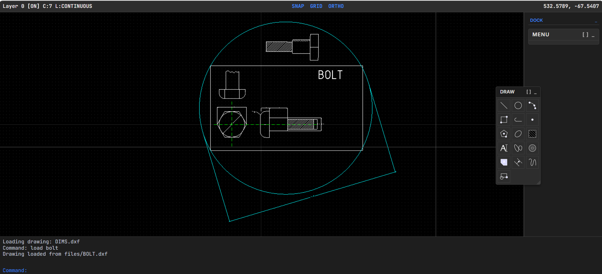

# WebCAD 

A faithful CAD drafting experience, reimagined for the modern web using **TypeScript**, **Three.js**, and **Vite**.



## 🚀 Features

### 🎯 Precision Drafting
-   **Geometric Kernel:** Integrated **OpenCascade.js** (OCCT) for professional-grade 2D/3D operations and file processing.
-   **Snap Engine:** Real-time geometric snapping (Endpoint, Midpoint, Center) and **GRID Snap**.
-   **Drafting Aids:**
    -   **ORTHO:** Lock movement to strictly horizontal/vertical axes.
    -   **GRID:** Visual reference dot grid that pans and scales with the viewport.
    -   **SNAP:** Discrete coordinate input intervals (configured via `SNAP` command).
    -   **Active Point Marker:** Dynamic cyan 'X' marker at cursor and reference points during point specification.
-   **Command Engine:** Fully asynchronous state-machine based command system.
-   **Coordinate Parser:** Supports absolute (`x,y`), relative Cartesian (`@dx,dy`), and relative Polar (`@dist<angle`) inputs.
-   **Visual Feedback:** Real-time "rubber-banding" previews, formatting echoing, and helper markers.

### 💾 File I/O & Interoperability
-   **DXF I/O Layer:** **Custom R12/R14 ASCII Writer & Parser** for industry-standard interoperability.
-   **IndexedDB Persistence:** Robust storage for drawings and 3D shapes using RxDB.
-   **Solid Persistence:** Switched to STEP format for reliable saving and loading of 3D boolean shapes.
-   **File Operations Window:** Dedicated UI panel listing DB projects and static files, featuring:
    -   **Date-Time Column:** Shows when the project was last updated.
    -   **Delete with Confirmation:** Safe deletion of stored projects.
-   **Main Menu Integration:** Integrated "Edit an EXISTING drawing" workflow with dynamic file listing and selection.

### ⌨️ Classic Commands
-   **LINE:** Continuous drawing with `Undo` (U), `Close` (C), and `Exit` (E/Enter) shortcuts.
-   **PLINE:** Connected sequences of line and arc segments with interactive mode switching and bulges.
-   **ARC:** 3-Point arc implementation (Start, Second Point, End).
-   **CIRCLE:** Center/Radius and Center/Diameter methods (toggle via `D`/`R` keys).
-   **POLYGON:** Regular polygons via Center/Radius or Edge methods with real-time radius/angle feedback.
-   **SOLID:** Solid-filled 2D planar triangles and quadrilaterals with chaining.
-   **SPLINE:** Cubic B-spline curves with multi-point interactive drafting and clamped knot support.
-   **TRACE:** Solid filled lines of specified width.
-   **POINT:** Single point entities.
-   **TEXT:** Single-line annotations with configurable height and rotation (using `osifont` ISO 3098).
-   **HATCH:** Pattern fill with full .PAT file support (ANSI31, ANSI32, etc.) and DXF persistence.
-   **LAYER:** Professional layer management (New, Set, On/Off, Freeze/Thaw, Lock/Unlock, Color, Linetype).
-   **LINETYPE (LTYPE):** Global and per-layer linetype definitions.
-   **REGEN:** Global viewport regeneration to synchronize display properties.
-   **UNITS:** Set drawing units (Decimal, Metric, Architectural) and coordinate precision (0-8 decimals).
-   **FILLET:** Professional corner rounding with automated trimming/extending and tangent arc insertion.
-   **TRIM / EXTEND:** Precise geometric modification using entity-to-entity intersections.
-   **OFFSET / ARRAY:** Distance-based offset and Rectangular/Polar array generation.
-   **BLOCK / INSERT:** Symbol management with block definitions and efficient viewport instantiation.
-   **ERASE / MOVE / COPY / STRETCH / ROTATE / SCALE / MIRROR:** Full suite of precise modification tools with crossing-window support.
-   **DIMENSIONING:** Professional engineering annotations including `DIMLINEAR`, `DIMALIGNED`, `DIMRADIUS` (with automatic one-click placement), and `DIMANGULAR`. Now features crisp high-resolution text rendering and automatic dimension line breaking for centered text.
-   **PLOT:** Plot to SVG or PDF. Features a professional text-to-path outlining solution using `opentype.js` to ensure fonts look identical on all devices without requiring font embedding.
-   **ZOOM:** `Zoom Window`, `Zoom All`, and factor-based zooming.
-   **NEW:** Workspace reset with safety confirmation prompt.

### 🎮 3D Interaction & Persistence
- **3D Gizmo**: Interactive translation and rotation gizmo for `Solid3D` entities.
- **Proportional Scaling**: Gizmo size automatically scales based on the selected object's bounding box.
- **Smart DXF I/O**: Manipulated position and rotation are saved to DXF (applying matrix transforms to vertices). Objects are intelligently grouped back on load using custom DXF XData.
- **Boolean Operations**: Support for Union, Subtract, and Intersect operations on 3D Solids via OpenCascade.
- **Rotation Preservation**: Boolean operations correctly preserve the position and rotation of operands by calculating the true center of shapes.
- **Solid Toolbar**: Floating toolbar for quick access to Box, Cylinder, Sphere, and Boolean operations.

### 🖥️ Modern Dark UI (AutoCAD Classic Style)
-   **Modern Dark Theme:** Sleek dark interface with clean typography, styled after classic AutoCAD but modernized for the web.
-   **Main Menu:** Classic text-based startup screen with project management options.
-   **Hierarchical Side Menu:** Fully interactive menu navigation (e.g., `DRAW` -> `LINE:`).
-   **Command Area:** Multi-line status log with persistent command prompt, cleaned interaction echoes, and discovery (`?` to list files/shapes).
-   **Status Bar:** Real-time world coordinate tracking (respecting `UNITS`), layer info, and clickable mode tags (**[SNAP]**, **[GRID]**, **[ORTHO]**).

### 🖱️ Selection & Interaction
-   **Selection Engine:** Advanced AABB-based hit-testing and precise geometry selection (including Lines, Circles, Arcs, and Dimensions).
-   **Box Selection:** Window/Crossing modes with dashed visual indicators.
-   **Auto-Focus:** Intelligent command line focus when typing alphanumeric keys without an active process.
-   **Pan & Zoom:** Intuitive middle-click pan and cursor-centered scroll zoom.

## 🛠️ Installation & Usage

### Setup
```bash
# Clone the repository
git clone https://github.com/elhakimz/webcad.git
cd webcad

# Install dependencies
npm install
```

### Development
```bash
# Start the dev server (includes local File API)
npm run dev
```
Open [http://localhost:5173/](http://localhost:5173/) in your browser.

### Testing
```bash
# Run unit tests (Vitest)
npm test

# Run linting
npm run lint
```

## 🏗️ Architecture

-   **`src/core/engine/handlers/`**: Strategy-based action handlers (Layer, Transform, View, IO, System).
-   **`src/core/engine/`**: Command management, drafting state, math utilities, and snapping logic.
-   **`src/core/io/`**: **DXF Exporter/Importer** and OpenCascade Service for geometric kernels.
-   **`src/core/model/`**: CAD entity definitions and the central `Document` store with centralized ID generation.
-   **`src/ui/`**: DOS-style screens and components (`MainMenuScreen`, `CommandLine`, `StatusBar`).

## 📍 Roadmap Priorities
-   [x] **Plotting:** Added `PLOT` command with support for SVG and high-quality vector PDF export (using text outlining via `opentype.js`).
-   [x] **Engineering Annotation:** Professional `DIMANGULAR` with one-click selection and standardized DXF R12 persistence for all dimension types.
-   [x] **Precision & Data Integrity:**
    -   **Strict Layer Isolation:** Selection engine now respects the current active layer for both commands and direct editing.
    -   **Robust Hatching:** Upgraded clipping algorithm using midpoint validation for leak-proof patterns in complex boundaries.
    -   **Data Consistency:** Fixed DXF persistence for `HATCH` (repeated codes) and `DONUT` (filled state preservation).
-   [x] **Advanced Curves:** **SPLINE** command with cubic B-spline drafting, snap support, and DXF R14 persistence.
-   [x] **Modification:** **STRETCH** command with crossing-window selection and dynamic vertex displacement.
-   [ ] **Snaps:** Intersection and Perpendicular snapping modes.
-   [x] **3D Modeling:** Initial primitives (BOX, CYLINDER, SPHERE) and CSG operations via OCCT with robust STEP persistence.

## 📄 License
MIT

---

**Note:** AutoCAD is an Autodesk product. This project is a modern web-based recreation of the classic AutoCAD 2.18 interface for educational and demonstration purposes.

**Disclaimer:** This application uses open-source icons from LibreCAD.
