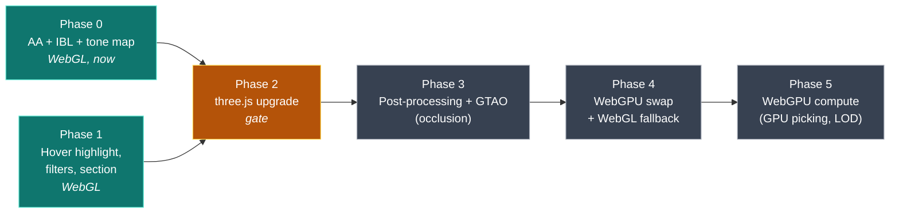

# Rendering Roadmap — toward an Onshape-grade viewport

> Sequences the visual-quality work against the WebGL→WebGPU migration so the two
> reinforce each other instead of colliding. Companion to
> [`kernel_abstraction.md`](./kernel_abstraction.md) (geometry side).

## Current state

> **Updated after phases A and B landed** (Plane epic #158, branch
> `feat/webgpu-migration-phase-a-b`). The original audit is in the git history.

| Area | Today | File |
|---|---|---|
| Renderer | `WebGLRenderer` with `antialias`, behind a `RendererBackend` seam | `src/render/RendererBackend.ts` |
| Backend selection | async probe, `?renderer=` override, automatic WebGL fallback | `RendererBackend.ts` (`chooseRenderer`) |
| Frame loop | one coalesced draw per tick; `render()` queues, `renderNow()` draws | `Viewer.ts` (`scheduleRender`) |
| Shadows | enabled, `PCFSoftShadowMap` | `RendererBackend.ts` (`createWebGLRenderer`) |
| Colour management | `outputColorSpace = SRGBColorSpace`; **tone mapping deliberately off** | `RendererBackend.ts` |
| Lighting | single `DirectionalLight`, **no IBL/environment** | `Viewer.ts:43` |
| Edges | `EdgesGeometry` + `LineSegments`, plus `OutlineEffect` on shaded frames | `Viewer.ts` |
| Post-processing | **none** (no `EffectComposer`) | — |
| Selection | raycaster pick, **no hover pre-highlight** | `Viewer.ts` |
| WebGPU | **not wired up.** POC and TSL material deleted; probe and reporting in place | `RendererBackend.ts` |
| three.js | **r185.1**, `@types/three` aligned | `package.json` |
| Cross-origin isolation | COOP/COEP set → `SharedArrayBuffer` available | `vite.config.ts:97` |

### What blocks the swap

Both found by doing the work, not by planning it:

- **`OutlineEffect` is WebGL-only** and draws every SHADED and ZEBRA frame. It wraps a
  `WebGLRenderer` and cannot be pointed at a `WebGPURenderer` (Plane #174).
- **A canvas can only ever hold one context type.** Once `getContext('webgl2')` has run,
  `getContext('webgpu')` returns null — so a renderer cannot be swapped in after boot,
  and the async decision has to move ahead of `new Viewer()` in `main.ts` (Plane #169).

"Onshape look" decomposed: **AA + soft IBL studio lighting + ambient occlusion +
crisp edges.** We have edges; the other three are unclaimed.

## Guiding principle

Do the **renderer-agnostic** wins on WebGL now (they carry straight over). Defer
anything that must be written twice (post-processing graph) until after the three
upgrade, and implement it once in the target API. Keep a **WebGL fallback** the
whole way.

---

## Phase 0 — Cheap, renderer-agnostic wins (do now, on WebGL)

No post-processing, no version bump. Pure `Viewer.ts` changes, all carry over to WebGPU.

- **Enable antialiasing** — `new THREE.WebGLRenderer({ canvas, antialias: true })`.
  Biggest per-character improvement to edge quality; currently off.
- **Color management & tone mapping** — set `outputColorSpace = SRGBColorSpace`,
  `toneMapping = ACESFilmicToneMapping`. Makes shading look modern, not flat.
- **IBL / studio lighting** — add `RoomEnvironment` + `PMREMGenerator` and set
  `scene.environment`. Single biggest "looks expensive" jump after AA; replaces
  the flat one-light look with soft, even, directional studio light.
- **Light rig** — keep the key `DirectionalLight` (for shadows) + a low hemisphere
  fill so faces facing away aren't pure black.

**Outcome:** noticeably more "engineered" viewport, zero architecture risk.
**Risk:** trivial. **Touches:** `Viewer.ts` constructor/init only.

---

## Phase 1 — Selection & interaction polish (WebGL, renderer-agnostic)

High daily value, independent of the renderer swap.

- **Hover pre-highlight** — raycast on mousemove (throttled), highlight the
  face/edge/body under the cursor before click. Reuses existing `Raycaster` +
  `faceMapping`. Biggest perceived-responsiveness gain.
- **Selection filters** — face / edge / vertex / body pick modes.
- **Persistent topology IDs** — firm up `faceMapping`/`edgeLines` so ids survive
  regeneration. Pays off twice: selection stability **and** the kernel-abstraction
  work (`TessellationResult` ids).
- **Section view** — a clipping plane via `renderer.clippingPlanes`; cheap, very
  "pro". (Pure WebGL feature, carries over.)

**Outcome:** feels interactive like Onshape. **Risk:** low. **Touches:**
`Viewer.ts` picking, selection state, a small UI toggle.

---

## Phase 2 — three.js upgrade (the gate for everything WebGPU/AO)

This is the riskiest single step and **blocks AO + WebGPU**, so isolate it.

- Bump `three` r160 → current; align `@types/three`.
- Expect breaking changes: color management defaults, addon import paths
  (`examples/jsm/...` → some moved), `BatchedMesh`, geometry/material tweaks.
- **Validate on the existing WebGL renderer** — no renderer swap yet. Phase 0/1
  features are the regression checklist.
- After this, WebGPU + TSL live at first-class entries (`three/webgpu`,
  `three/tsl`) instead of the old `examples/jsm/...` paths the POC uses.

**Outcome:** modern, stable base. **Risk:** medium (broad but shallow). **Touches:**
`package.json`, any addon imports, the WebGPU POC import paths, `Viewer.ts`.

---

## Phase 3 — Post-processing + Ambient Occlusion

Do this **once**, in the target API, after Phase 2.

- Stand up a post-processing pipeline (`EffectComposer` on WebGL, or the
  `PostProcessing` node graph on WebGPU/TSL).
- **GTAO** (Ground-Truth AO — supersedes SSAO): soft contact-darkening in
  crevices/corners. The "occlusion" you asked about, and the marquee quality win.
- **Outline / selection-glow pass** — clean selection highlight, depends on the
  same pipeline.
- Optional: FXAA/TAA if MSAA isn't enough once a composer is in the path
  (composer can bypass the renderer's built-in MSAA).

**Outcome:** Onshape-grade depth and selection feedback. **Risk:** medium.
**Why here:** writing the AO/outline graph before the three upgrade means writing
it twice — wasteful.

---

## Phase 4 — WebGPU renderer swap (behind a flag)

- Async bootstrap: `await renderer.init()` (WebGPU is async, unlike WebGL).
- **Detect `navigator.gpu`; fall back to WebGL** automatically. Keep both paths.
- Port the **3 custom shaders** (only hits are in `Viewer.ts`) to TSL; stock
  materials (44 `LineBasicMaterial`, 18 `MeshBasicMaterial`, etc.) auto-convert.
- Re-validate Phase 0–3 features under WebGPU.
- Real upside is **compute shaders** (next phase), not raw FPS on static scenes.

**Outcome:** future-proof renderer, fallback intact. **Risk:** medium.
**Touches:** `Viewer.ts:201` swap point, the 3 shaders, async init flow.

---

## Phase 5 — WebGPU compute (the payoff)

Things only practical with compute, amplifying the geometry-side gains:

- **GPU picking** — id-buffer pass instead of CPU raycast; instant selection on
  huge models.
- **GPU-side mesh post-processing** — normals/AO/LOD on the GPU.
- Pairs with the kernel work: progressive/LOD tessellation streamed from the
  kernel, refined/shaded on the GPU.

---

## Sequencing at a glance



## Notes / risks

- **Phases 0 and 1 are worth doing on their own merits** even if WebGPU never
  happens — biggest perceived-quality gain for least effort/risk.
- **Don't build the AO/outline graph before the three upgrade** (Phase 2) — you'd
  write it twice (`EffectComposer` then TSL).
- Keep the **WebGL fallback** permanently; WebGPU coverage still has gaps
  (older Safari, some drivers).
- The geometry-side roadmap ([`kernel_abstraction.md`](./kernel_abstraction.md))
  is independent and can proceed in parallel; Phase 5 (GPU picking, LOD) is where
  the two roadmaps converge.
```
